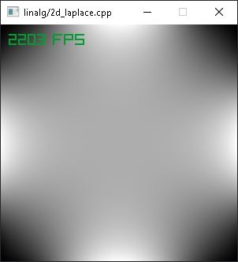
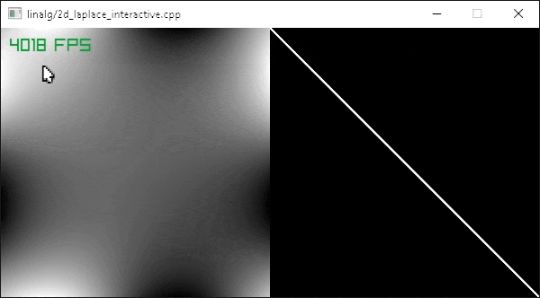

### 2d_laplace.cpp
2D Laplace equation solver with 5-point stencil on n×n grid.  
Uses `SimplicialCholesky` for SPD matrix factorization.



**Build & Run:**
```bash
bazel run //linalg:2d_laplace -c opt
```

### 2d_laplace_interactive.cpp
Interactive version with real-time visualization.




**Build & Run:**
```bash
bazel run //linalg:2d_laplace_interactive -c opt
```
