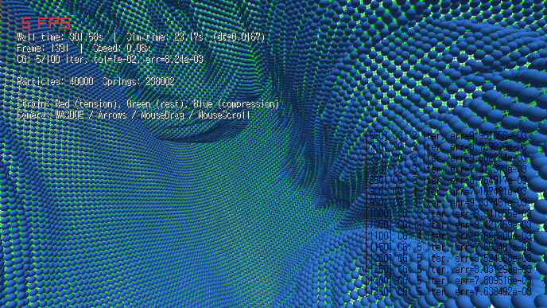

# small/cloth benchmark

this package includes a headless implicit-euler benchmark

## run

```bash
bazel run -c opt //small/cloth:bench
```

## output

- json files are appended to `small/cloth/bench/results/`
- default filename format is `bench_YYYYMMDD_HHMMSS.json`

## current benchmark setup

- sizes: `50`, `100`, `200`
- warmup: `10` steps per case
- measured loop: `ecs.progress(dt)` per benchmark iteration
